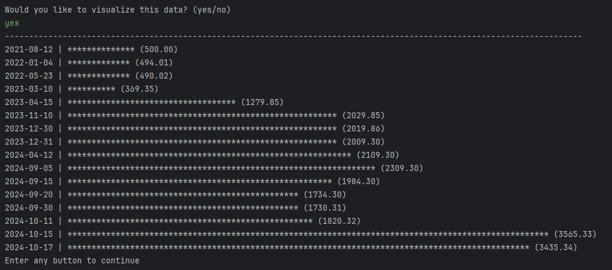

# Accounting Ledger Application

This is an accounting ledger application made in Java that allows users to track their transactions.
The application reads from a CSV file to load transactions and transactions added will be saved to this CSV file to allow
for data storage between sessions. This application allows for users to add deposits, add payments, or view their transactions.

## Table of Contents

- [Installation](#installation)
- [Usage](#usage)

## Installation

To install the application follow these steps:

1) ### Clone the Repository:
    ```commandline
    git clone https://github.com/nitrodum/Capstone-1-Accounting-Ledger-Application.git
    ```
2) ### Download Java:

    This application uses Java so if you do not have it you can download Java [here](https://www.oracle.com/java/technologies/downloads/).

3) ### Run the Application:
    
    a) If you have an IDE, you can just run the application with that IDE.
    
    b) If you want to run it without an IDE you can follow these steps:

    1) From where you cloned this repository type the following into your command line to move to the project root directory:

        ```commandline
       cd /AccountingLedgerApplication
       ```

    2) Type the following into your command line to compile the application:
        
        ```commandline
       javac src\main\java\com\pluralsight\*.java
       ```
       
    3) Type the following into your command line to run the application:
        
         ```commandline
       java -cp src\main\java com.pluralsight.AccountingLedger
       ```
       
## Usage

1) ### Home Screen:
    
    - The application start by showing the user's current balance and offers options to add a deposit, make a payment, view the ledger, or exit.
    
    - Input the corresponding letter to perform an action.

    
   
    #### Add Transactions:

   - You can add a transaction from the home screen by entering either D (deposits) or P (payments).
   - Adding a deposit will add to the balance and adding a payment will decrease the balance.
   - Adding a transaction will ask the user for details about the transaction such as a description, vendor name, and the amount of the transaction.
   - The user has an option to enter the date and time of the transaction or to use the current date and time.
   - The application will not allow for the user to enter a payment if their it exceeds their current balance.
    
    
2) ### Ledger Screen
    - The ledger screen allows the user to view all their transaction, just their deposits, just their payments, or to view the report screen.
   
    #### All Transaction:
    - Entering A on the ledger screen will allow the user to view all transaction.
   
   
    #### All Deposits:
    - Entering D on the ledger screen will allow the user to view all deposits.

   #### All Payments:
    - Entering P on the ledger screen will allow the user to view all payments.
   
3) ### Reports Screen

    - The report screen allows users to filter and view transactions.
    
   
4) ### Data Visualization
    
    - When viewing transactions, the user is prompted after getting the specified transactions if they want to visualize the data.
    - If the user enters yes, a bar graph will be displayed, with the dates being the y-axis and the cumulative total of the balance being displayed as the x-axis.
   
    - The balance is required to stay positive, but on smaller time frames, (i.e. for previous month) the balance can be negative for that time frame.
    - A positive balance will be displayed with "*" filling the bar and a negative balance will be displayed with "-" filling the bar.
   

[Back To Top](#accounting-ledger-application)