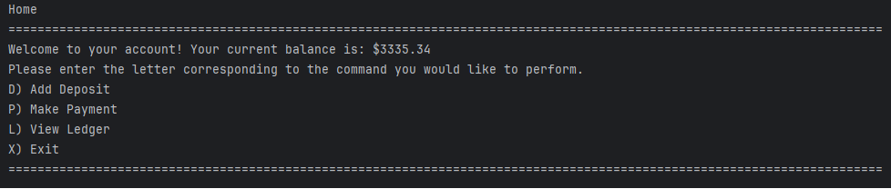

# Accounting Ledger Application

This is an accounting ledger application made in Java that allows users to track their transactions.
The application reads from a CSV file to load transactions and transactions added will be saved to this CSV file to allow
for data storage between sessions. This application allows for users to add deposits, add payments, or view their transactions.

## Installation

To install the application follow these steps:

1) **Clone the Repository**:
    ```commandline
    git clone https://github.com/nitrodum/Capstone-1-Accounting-Ledger-Application.git
    ```
2) **Download Java**:

    This application uses Java so if you do not have it you can download Java [here](https://www.oracle.com/java/technologies/downloads/).

3) **Run the Application**:
    
    a) If you have an IDE, you can just run the application with that IDE.
    
    b) If you want to run it without an IDE you can follow these steps:

    1) From where you cloned this repository type the following into your command line to move to the project root directory:

        ```commandline
       cd /AccountingLedgerApplication
       ```

    2) Type the following into your command line to compile the application:
        
        ```commandline
       javac src\main\java\com\pluralsight\*.java
       ```
       
    3) Type the following into your command line to run the application:
        
         ```commandline
       java -cp src\main\java com.pluralsight.AccountingLedger
       ```
       
## Usage

1) **Home Screen**:
    
    - The application start by showing the user's current balance and offers options to add a deposit, make a payment, view the ledger, or exit.
    
    - Input the corresponding letter to perform an action.

    